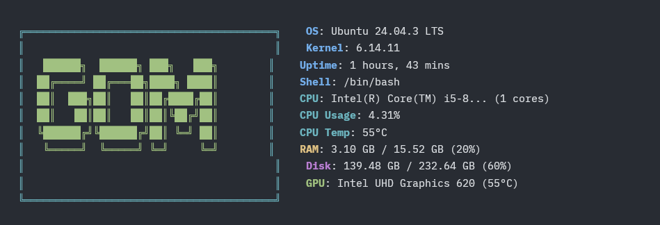
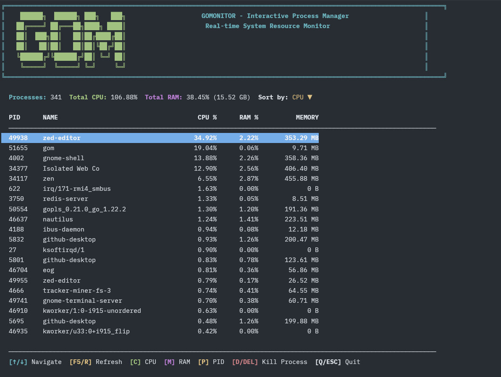

# GoMonitor


Minimalist TUI, resource manager for Linux **written in Go**. It provides real-time and snapshot views of CPU, RAM, and GPU metrics, designed to offer a clear overview of system hardware utilization directly in the terminal.

## 📸 Screenshots

### Default View


### Interactive Mode


---

## ✨ Features

- 🚀 **Lightweight** - Low resource consumption.
- 🎨 **Interactive TUI** - Navigate, sort, and kill processes.
- 📊 **Real-time Metrics** - GPU, CPU, RAM and Disk monitoring.
- ⚙️ **Auto-start** - Optional configuration to run on terminal startup.

---

## Installation

**Prerequisites:** Linux, Go 1.16+, Make.

```bash
# 1. Clone the repository
git clone [https://github.com/dfialho05/GoMonitor.git](https://github.com/dfialho05/GoMonitor.git)
cd GoMonitor

# 2. Compile and install
make install

# 3. Run
gom
```

---

## Usage & Commands

gom, Default View: Shows the logo and system summary side-by-side.
gom -f / --full, Interactive Mode: Full TUI to manage processes.
gom -a / --all, Dashboard: View CPU, RAM, GPU, Disk, and Top Processes at once.
gom -c / --cpu, CPU: Detailed processor stats.
gom -r / --ram, RAM: Memory and Swap usage.
gom -g / --gpu, GPU: NVIDIA graphics card details.
gom -d / --disk, Disk: Storage usage and partitions.
gom -t [N], Top: Show top N resource-hungry processes (Default: 10).
gom -s / --startup, Auto-start: Toggle running gom automatically on terminal open.


---

## Uninstallation

```bash
make uninstall
```

---

## License

This project is licensed under the MIT License.

Created by David Fialho
